# Scholar Harness 全功能流程线路图

本文档用于交给 GPT、Mermaid、Excalidraw、FigJam 或其他绘图工具，生成 Scholar Harness 项目的全功能流程图。建议最终画成一张横向大图，分为五层：用户界面层、后端 API 层、AI/Agent 层、数据存储层、输出成果层。

## 给 GPT 的绘图提示词

请根据下面内容绘制一张「Scholar Harness 全功能流程线路图」。要求：

- 使用横向流程图，从左到右展示：用户入口 -> 前端功能 -> API 路由 -> Agent/服务 -> 本地数据 -> 输出结果。
- 用泳道或分层结构区分：前端 UI、Express API、AI/Agent、数据存储、最终产物。
- 重点突出这些主链路：对话写作、长期记忆、Embedding 文献库、PDF Wiki 论点库、实验资料上传、目标期刊风格提取、AutoResearch、一键写论文、数据分析与 R 作图。
- 同类功能用同色系，推荐深绿色为主色，辅以灰色、蓝绿色、金色区分数据、AI、输出。
- 箭头需要标出关键 API 或关键动作，但不要把每个小接口都画成大节点；密集接口可以放到模块旁边作为小注释。
- 输出一张总览图，再输出 3-5 张局部放大图：文献/PDF Wiki、实验资料/数据分析、AutoResearch、一键写作、长期记忆。

## 一句话总览

Scholar Harness 是一个本地优先的学术/文稿写作工作台：用户上传文献、PDF、实验资料、目标期刊样例和研究主题后，系统通过两级 Agent、Codex CLI、Embedding 检索、PDF Wiki 证据抽取、长期记忆和 AutoResearch 工作流，生成可追溯的研究报告、论文草稿、数据分析结果、R 作图代码和 Word/Markdown 下载文件。

## 顶层总流程

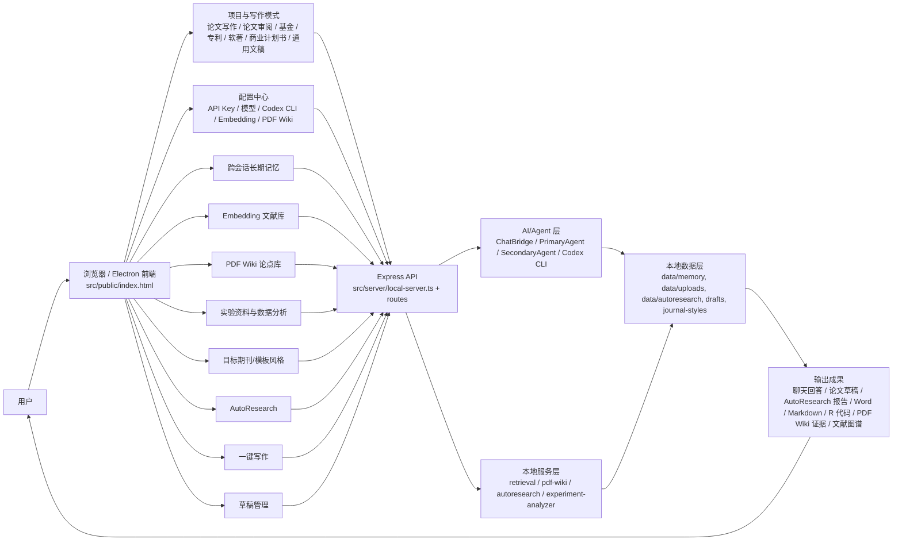

## 前端入口和主要按钮

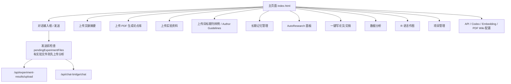

## 项目和写作模式

写作模式由 `PROJECT_WRITING_PROFILES` 控制，前端和后端都会根据当前 profile 改变文案、资料标签、风格标签和一键写作目标。

| 模式 ID | 用途 | 主要输出 |
|---|---|---|
| `paper-writing` | 论文辅助写作 | 论文草稿、参考文献、Word |
| `paper-review` | 论文辅助审阅 | 审稿意见、修改建议、审阅报告 |
| `grant-writing` | 基金辅助写作 | 申报书草稿、评审要点 |
| `patent-writing` | 专利辅助写作 | 技术交底、权利要求、说明书草稿 |
| `software-copyright` | 软著写作 | 软著材料、功能说明 |
| `business-plan` | 商业计划书写作 | 商业计划书 |
| `general-writing` | 通用文稿写作 | 普通文稿 |

核心接口：

- `GET /api/project-writing-profiles`
- `POST /api/projects/new`
- `GET /api/projects`
- `GET /api/projects/current`
- `POST /api/projects/current/profile`
- `POST /api/projects/:projectId/open`
- `DELETE /api/projects/:projectId`

## 对话与两级 Agent 流程

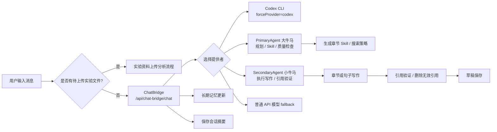

关键代码：

- `src/server/routes/chat-bridge.ts`
- `agents/primary-agent.ts`
- `agents/secondary-agent-v2.ts`
- `agents/agent-collaboration-workflow.ts`
- `workflows/conversation-flow.ts`

## 跨会话长期记忆流程

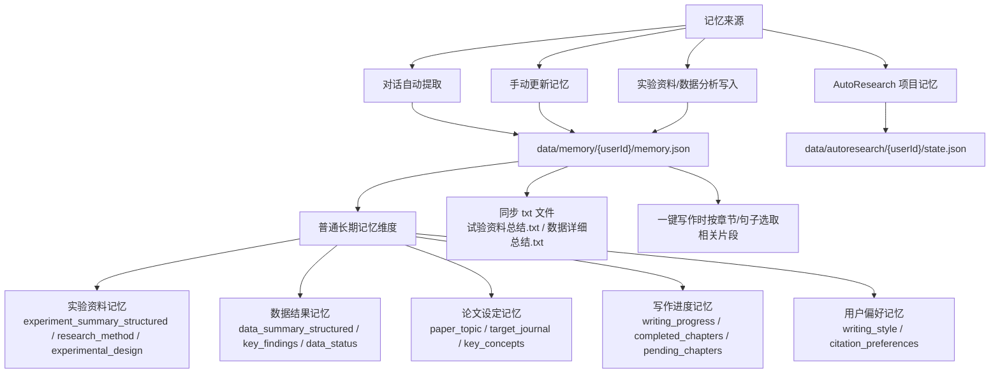

关键接口：

- `POST /api/memory/update`
- `GET /api/memory/:userId`
- `GET /api/memory/detail/:userId`
- `GET /api/memory/summary-status/:userId`
- `POST /api/memory/clear-selected/:userId`
- `DELETE /api/memory/clear/:userId`
- `POST /api/research-material/save`
- `POST /api/data-summary/save`
- `POST /api/summary/generate`

## Embedding 文献库流程

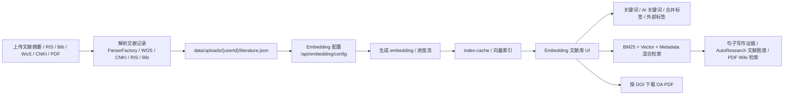

关键接口：

- `POST /api/upload`
- `GET /api/literature`
- `POST /api/literature/search`
- `GET /api/embedding/config`
- `POST /api/embedding/config`
- `GET /api/embedding/progress`
- `GET /api/embedding/progress/stream`
- `GET /api/embedding-library`
- `POST /api/embedding-library/filter`
- `POST /api/embedding-library/manual-merge`
- `POST /api/embedding-library/outer-tags`
- `POST /api/embedding-library/refresh-merged-tags`
- `POST /api/embedding-library/favorites`
- `POST /api/embedding-library/download-by-doi`
- `POST /api/oa-paper-download`

核心代码：

- `src/literature/parsers/*`
- `src/literature/retrieval/*`
- `src/public/embedding-library.js`
- `src/server/routes/embedding-library.ts`
- `src/utils/retrieval-engine-manager.ts`

## PDF Wiki 论点库流程

当前 PDF Wiki 已从“点云优先”改回“句子级论点库”：主要提取论文 Introduction、Discussion、Conclusion 中的句子，识别句尾显式引用，匹配参考文献，再判断句子是否可成为论点。

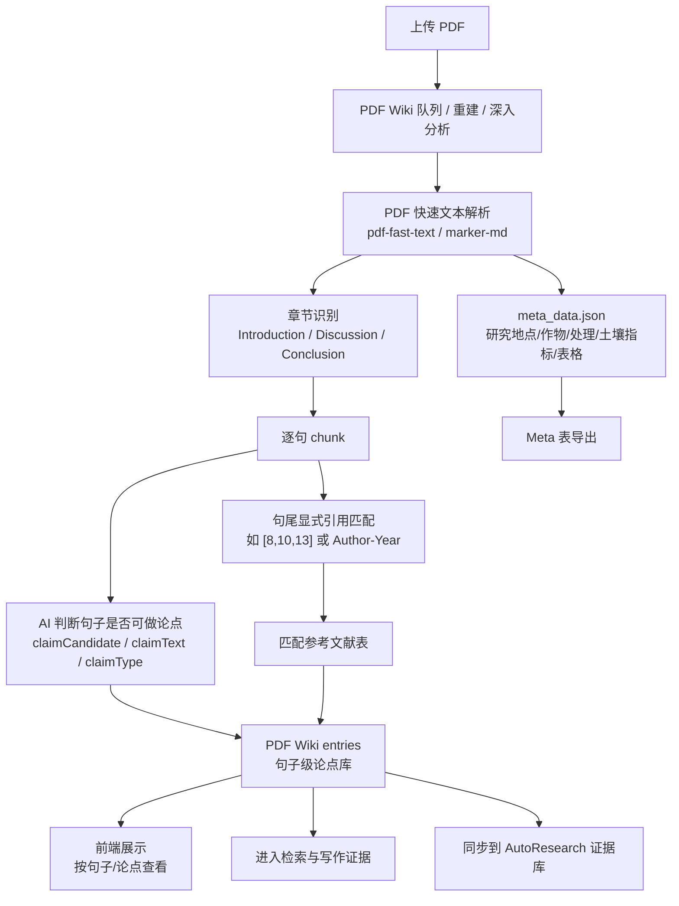

管理功能：

- PDF 列表、分组、删除、收藏、合并论点。
- PDF 深入分析。
- Meta 模板上传、删除、导出。
- 论点库 rebuild。

关键接口：

- `GET /api/pdf-wiki/status`
- `GET /api/pdf-wiki/entries`
- `POST /api/pdf-wiki/entries/delete`
- `POST /api/pdf-wiki/entries/merge`
- `POST /api/pdf-wiki/entries/favorite`
- `GET /api/pdf-wiki/pdfs`
- `GET /api/pdf-wiki/meta`
- `POST /api/pdf-wiki/meta/delete`
- `POST /api/pdf-wiki/meta/tables/export`
- `POST /api/pdf-wiki/pdfs/:pdfId/deep-analysis`
- `POST /api/pdf-wiki/rebuild`
- `GET /api/pdf-wiki/config`
- `POST /api/pdf-wiki/config`
- `GET /api/pdf-wiki/meta-template`
- `POST /api/pdf-wiki/meta-template`
- `DELETE /api/pdf-wiki/meta-template`

核心代码：

- `src/utils/pdf-wiki-manager.ts`
- `src/utils/pdf-wiki-pdf-management.ts`
- `src/utils/pdf-fast-text.ts`

## 实验资料上传、数据分析与 R 作图流程

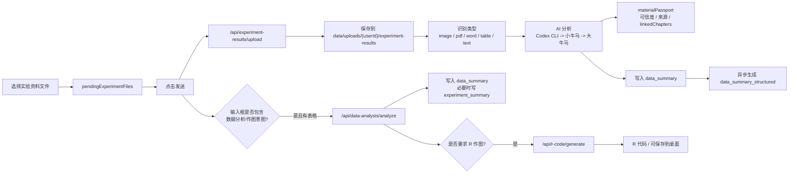

注意：上传按钮文案是“上传实验资料”，但这条链路当前更偏“实验结果/数据文件分析”，默认主要写入 `data_summary`。如果用户手动录入实验设计、研究地点、处理设置，应走 `POST /api/research-material/save` 写入 `experiment_summary`。

关键接口：

- `POST /api/experiment-results/upload`
- `GET /api/experiment-results/:userId`
- `DELETE /api/experiment-results/:userId/:fileName`
- `POST /api/data-analysis/inspect`
- `POST /api/data-analysis/analyze`
- `GET /api/data-analysis/methods`
- `POST /api/r-code/generate`
- `POST /api/r-code/save`
- `POST /api/r-code/debug`
- `GET /api/r-code/chart-types`

核心代码：

- `src/server/routes/experiment-results.ts`
- `src/server/services/experiment-analyzer.ts`
- `src/server/routes/data-analysis.ts`
- `src/server/routes/r-code.ts`

## 目标期刊风格、Author Guidelines 与 Cover Letter 要求

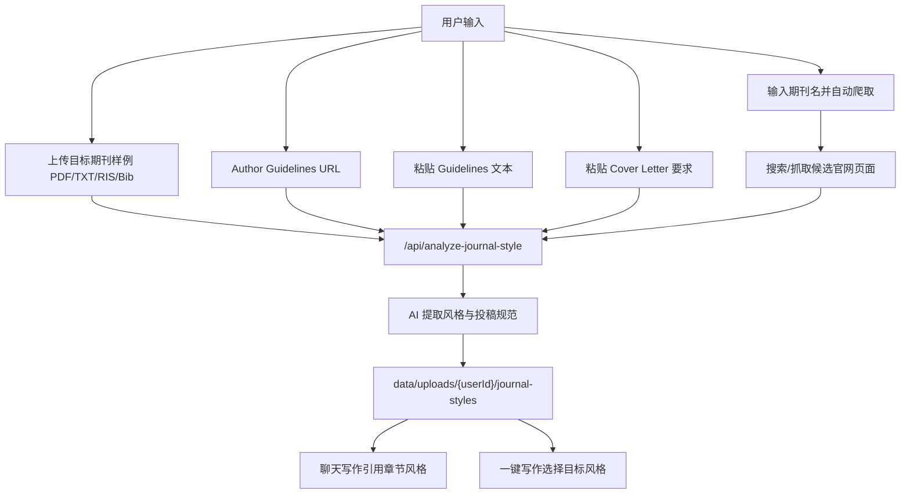

提取内容包括：

- 章节结构和写作风格。
- 句式、语气、常见表达。
- 目标期刊参考文献格式。
- `author_guidelines`
- `cover_letter_requirements`
- `submission_materials.crawl_sources`

关键接口：

- `POST /api/analyze-journal-style`
- `GET /api/journal-styles/list`
- `GET /api/journal-styles/:journal/:section`

## AutoResearch 流程

AutoResearch 是长期自主研究任务，不是普通聊天。用户只填研究主题，系统自动同步文献图谱和证据库，生成假设、缺口、实验计划、草稿框架、自评和最终报告。

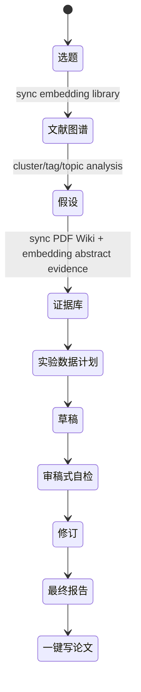

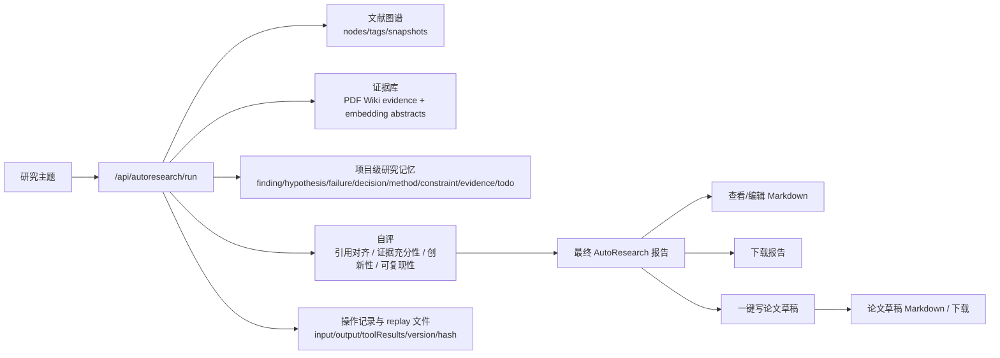

关键接口：

- `GET /api/autoresearch/state`
- `GET /api/autoresearch/progress`
- `POST /api/autoresearch/start`
- `POST /api/autoresearch/run`
- `POST /api/autoresearch/stages`
- `POST /api/autoresearch/memory`
- `POST /api/autoresearch/sync-pdf-wiki`
- `POST /api/autoresearch/sync-embedding-library`
- `POST /api/autoresearch/evaluate`
- `GET /api/autoresearch/final-reports/:reportId/markdown`
- `PUT /api/autoresearch/final-reports/:reportId/markdown`
- `GET /api/autoresearch/final-reports/:reportId/download`
- `POST /api/autoresearch/final-reports/:reportId/write-paper`
- `GET /api/autoresearch/paper-drafts/:draftId/markdown`
- `PUT /api/autoresearch/paper-drafts/:draftId/markdown`
- `GET /api/autoresearch/paper-drafts/:draftId/download`
- `POST /api/autoresearch/operations`

核心状态文件：

- `data/autoresearch/{userId}/state.json`
- `projectMemory`
- `failureLessons`
- `evidenceLibrary`
- `literatureMap`
- `operations`
- `evaluations`
- `finalReports`
- `paperDrafts`

## 一键写论文/文稿流程

一键写作是后台长任务，有进度条和打字机式当前状态显示。它根据项目模式生成论文、审稿意见、基金、专利、软著、商业计划书或通用文稿。

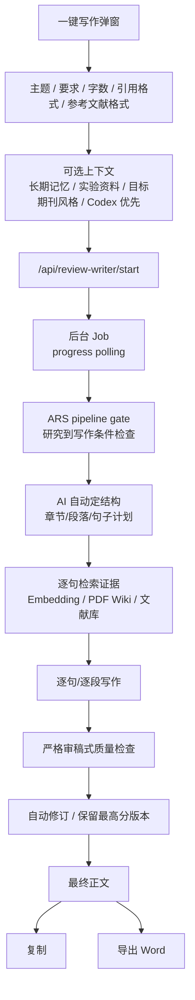

关键接口：

- `POST /api/review-writer/start`
- `GET /api/review-writer/progress/:jobId`
- `POST /api/review-writer/stop/:jobId`
- `POST /api/review-writer/restart/:jobId`
- `GET /api/review-writer/latest`
- `POST /api/review-writer/generate`
- `POST /api/review-writer/docx`

写作时可使用的上下文：

- 长期记忆：`data/memory/{userId}/memory.json`
- 实验/项目资料：`experiment_summary`、`experiment_summary_structured`、`research_method`、`experimental_design`、`试验资料总结.txt`
- 文献库：Embedding 文献库、PDF Wiki 论点库、普通 literature.json
- 目标期刊/模板风格：`journal-styles`
- Skills：`sci_writing_skills/*`、`skills/paper-writing/SKILL.md`

## 草稿管理流程

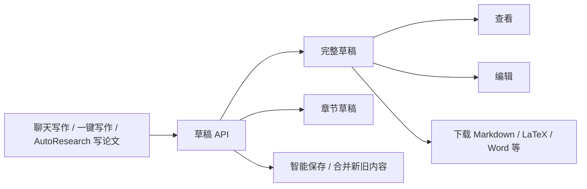

关键接口：

- `GET /api/draft/:userId`
- `GET /api/draft/:userId/download`
- `POST /api/draft/:userId`
- `PUT /api/draft/:userId`
- `POST /api/draft/:userId/smart-save`
- `DELETE /api/draft/:userId`
- `POST /api/draft/:userId/confirm-action`
- `POST /api/chapter-draft/:userId`
- `DELETE /api/chapter-draft/:userId/:chapter`
- `POST /api/paper-draft/save`

## 检索增强写作流程

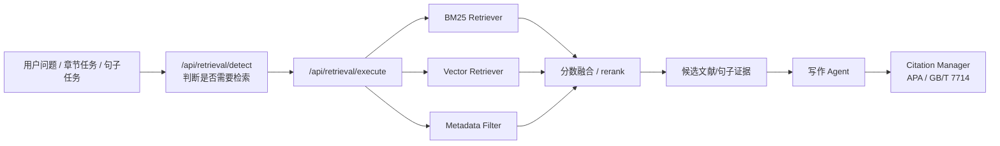

核心代码：

- `src/literature/retrieval/bm25-retriever.ts`
- `src/literature/retrieval/vector-retriever.ts`
- `src/literature/retrieval/hybrid-engine.ts`
- `src/literature/retrieval/sentence-retriever.ts`
- `src/literature/citation/citation-manager.ts`

## 备份、导入导出和系统配置

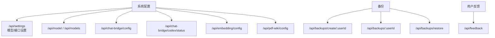

关键数据目录：

| 目录/文件 | 作用 |
|---|---|
| `data/memory/{userId}/memory.json` | 普通跨会话长期记忆 |
| `data/memory/{userId}/conversations/*.json` | 会话记录与摘要 |
| `data/uploads/{userId}/literature.json` | 文献库 |
| `data/uploads/{userId}/index-cache/` | 检索/向量索引缓存 |
| `data/uploads/{userId}/journal-styles/` | 目标期刊或模板风格 |
| `data/uploads/{userId}/experiment-results/` | 上传的实验资料/结果文件 |
| `data/autoresearch/{userId}/` | AutoResearch 状态、报告、回放 |
| `data/chat-bridge-config.json` | 大牛马/小牛马/Codex 配置 |
| `data/backups/` | 项目备份 |

## 节点清单，便于绘图

### 用户入口节点

- 主对话
- 上传文献摘要
- 上传 PDF 生成论点库
- 上传实验资料
- 上传目标期刊样例
- 目标期刊 Author Guidelines / Cover Letter 爬取
- AutoResearch
- 一键写论文/文稿
- 数据分析
- R 语言作图
- 长期记忆管理
- 项目管理
- API/模型配置

### 后端 API 模块节点

- Auth/Quota/Feedback
- ChatBridge
- Memory
- Literature
- Embedding Library
- PDF Wiki
- Experiment Results
- Data Analysis
- R Code
- Journal Style
- AutoResearch
- Review Writer
- Draft
- Project Manager
- Backup Manager

### AI/Agent 节点

- Codex CLI
- PrimaryAgent 大牛马
- SecondaryAgent 小牛马
- LiteratureSearchAgent
- ParallelSearchOrchestrator
- SentenceChunker
- ParagraphAgent
- CowAgent
- ChatBridge provider fallback

### 数据节点

- memory.json
- conversations
- literature.json
- index-cache
- pdf-wiki store
- meta_data.json
- journal-styles
- experiment-results
- drafts
- autoresearch state
- replay files
- backups

### 输出节点

- 聊天回答
- 章节草稿
- 完整论文/文稿
- Word 文件
- Markdown 文件
- AutoResearch 最终报告
- AutoResearch 论文草稿
- PDF Wiki 论点库
- PDF Meta 表
- 文献图谱
- 数据分析报告
- R 作图代码
- 期刊风格指南
- Cover Letter 要求

## 建议最终绘图布局

```text
[用户]
  |
  v
[前端主界面 index.html]
  |-- 对话写作 ---------> ChatBridge/Agents ---------> 草稿/记忆/会话
  |-- 文献上传 ---------> 文献解析/Embedding --------> 文献库/检索证据
  |-- PDF 上传 ---------> PDF Wiki 深入分析 -------> 句子级论点库/Meta
  |-- 实验资料上传 -----> Codex/小牛马/大牛马 -----> data_summary/结构化总结
  |-- 数据分析/R作图 --> 统计分析/R 代码 ----------> 分析报告/R脚本
  |-- 期刊风格 ---------> 样例+官网爬虫+AI提取 ----> journal-styles
  |-- AutoResearch -----> 文献图谱+证据库+自评 ----> 最终报告/论文草稿
  |-- 一键写作 ---------> 结构规划+逐句检索+审稿 --> Word/Markdown
  |-- 记忆管理 ---------> memory.json/txt ----------> 后续写作上下文
  |-- 项目管理/备份 ----> project-manager/backup ---> 项目切换/恢复
```

## 图中需要强调的规则

- 上传实验资料后，发送消息会先走实验资料上传分析，不再继续普通聊天。
- PDF Wiki 句子引用匹配以显式文中引用为主，不把 semantic 候选当成直接引用。
- 实验资料/项目资料用于背景和方法上下文，不作为文献引用证据。
- 写作中的科学事实和引用应来自文献库、PDF Wiki 证据或用户明确提供的数据。
- AutoResearch 的核心不是一次性生成文本，而是“文献图谱 -> 假设 -> 证据库 -> 自评 -> 报告 -> 草稿”的可追溯闭环。
- 所有长期任务都应记录输入、输出、工具结果、版本和可回放文件。

